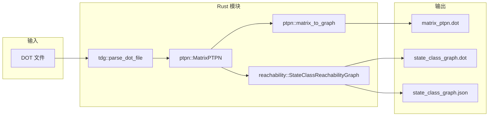

# PTPN 设计文档

## 1. 模块划分

```
ptpn/
├── error.rs        # 错误类型 (thiserror)
├── tdg/            # TDG 解析
│   ├── dot_parser.rs
│   └── task_types.rs
├── ptpn/           # PTPN 核心
│   ├── matrix.rs   # 矩阵形式
│   ├── graph.rs    # 图形式 (petgraph)
│   └── time_interval.rs
├── dbm.rs          # DBM 差分界矩阵
├── state_class.rs  # 状态类
└── reachability.rs # 状态类可达图
```

## 2. 数据流



## 3. 核心数据结构

### 3.1 TDG

- `Tdg`: 解析后的任务依赖图，含 `nodes_type`, `edges`, `all_task` 等
- `NodeType`: `Periodic` | `Aperiodic` | `Dist` | `Sync` | `Empty`

### 3.2 MatrixPTPN

- `Place`: id, name, capacity
- `Transition`: id, name, time_interval, priority, core, suspendable
- `Pre`: |P|×|T|, `Post`: |T|×|P|, `m0`: 初始标识

### 3.3 DBM

- `Dbm`: matrix (差分界), frozen_clocks
- 操作: add_clock, elapse_time, restrict_for_firing, minimize (Floyd-Warshall)

### 3.4 StateClass

- marking, z1, z2 (双 DBM), enabled, suspended, cumulative_time

### 3.5 可达图

- `StableDiGraph<StateClass, TransitionEdge>` (petgraph)
- BFS 探索: select_per_core → apply_preemption → maximal_time_elapse → fire_with_dbm

## 4. petgraph 使用

- **PtpnGraph**: `DiGraph<(String, Vertex), Edge>` 用于 PTPN 可视化
- **StateClassReachabilityGraph**: `StableDiGraph<StateClass, TransitionEdge>` 用于状态类图
- `StableDiGraph` 保证节点/边删除后索引稳定，适合 BFS 中动态添加

## 5. 错误与日志

- **错误**: `thiserror` 定义 `TdgParseError`, `PtpnErrorKind`, `DbmError`, `ReachabilityError`
- **日志**: `tracing` + `tracing-subscriber`，支持 `RUST_LOG=ptpn=debug`
