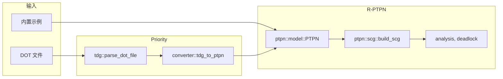

# PTPN 设计文档

## 1. 架构

本项目基于 [R-PTPN](https://github.com/kevindadi/R-PTPN) 库，提供 TDG 解析与转换层。

```
priority/
├── src/
│   ├── main.rs       # CLI 入口
│   ├── lib.rs        # 库根
│   ├── error.rs      # 错误类型
│   ├── tdg/          # TDG DOT 解析
│   │   ├── dot_parser.rs
│   │   └── task_types.rs
│   └── converter.rs  # TDG -> R-PTPN PTPN 转换
```

## 2. 数据流



## 3. R-PTPN 库

- **PTPN**: 11 元组 (p1, p2, t1, t2, f, m0, si, tasks, tak, req, pri)
- **SCG**: 状态类图，含 classes 和 edges
- **analysis**: compute_wcet, compute_wcrt
- **deadlock**: detect_global_deadlocks, detect_starvation_sccs

## 4. TDG 转换

`converter::tdg_to_ptpn` 将 TDG 任务图转换为 R-PTPN 的 PTPN 格式：
- 每个任务: entry -> get_core -> ready -> exec -> exit
- 周期任务: period -> fire -> entry
- 资源: cpu (p2)
- 边: 任务间依赖
