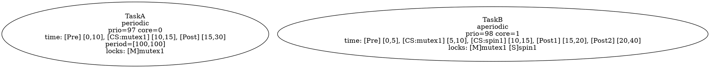

# PTPN JSON 输入格式规范

本文档定义了 PTPN (Priority Timed Petri Net) 工具的 JSON 输入格式规范。

## 概述

JSON 文件描述了一个任务依赖图 (Task Dependency Graph)，包含任务节点、任务间依赖关系以及系统配置信息。

## 完整 JSON Schema

```json
{
  "$schema": "http://json-schema.org/draft-07/schema#",
  "title": "PTPN Task Graph",
  "type": "object",
  "required": ["configuration", "nodes", "edges"],
  "properties": {
    "graph": {
      "type": "object",
      "properties": {
        "name": { "type": "string" }
      }
    },
    "configuration": {
      "type": "object",
      "required": ["num_cpus", "cores_per_cpu", "shared_locks"],
      "properties": {
        "num_cpus": { "type": "integer", "minimum": 1 },
        "cores_per_cpu": { "type": "integer", "minimum": 1 },
        "shared_locks": {
          "type": "array",
          "items": { "type": "string" },
          "description": "锁名称必须以 'mutex' 或 'spin' 开头"
        }
      }
    },
    "nodes": {
      "type": "array",
      "items": {
        "type": "object",
        "required": ["id", "type"],
        "properties": {
          "id": { "type": "string" },
          "type": {
            "type": "string",
            "enum": ["periodic", "aperiodic", "fork", "join", "empty"]
          },
          "priority": { "type": "integer" },
          "core": { "type": "integer" },
          "time": {
            "type": "array",
            "items": {
              "type": "array",
              "minItems": 2,
              "maxItems": 2,
              "items": { "type": "integer" }
            }
          },
          "period": {
            "type": "array",
            "minItems": 2,
            "maxItems": 2,
            "items": { "type": "integer" }
          },
          "locks": {
            "type": "array",
            "items": { "type": "string" }
          }
        }
      }
    },
    "edges": {
      "type": "array",
      "items": {
        "type": "object",
        "required": ["source", "target"],
        "properties": {
          "source": { "type": "string" },
          "target": { "type": "string" },
          "label": { "type": "string" },
          "style": { "type": "string" }
        }
      }
    }
  }
}
```

## 顶层结构

| 字段 | 类型 | 必需 | 说明 |
| ------ | ------ | ------ | ------ |
| `graph` | object | 否 | 图元数据 |
| `graph.name` | string | 否 | 图名称 |
| `configuration` | object | 是 | 系统配置 |
| `nodes` | array | 是 | 任务节点列表 |
| `edges` | array | 是 | 依赖边列表 |

---

## configuration 配置

```json
"configuration": {
  "num_cpus": 2,
  "cores_per_cpu": 4,
  "shared_locks": ["mutex1", "spin1", "mutex_global"],
  "policy": "fixed"
}
```

| 字段 | 类型 | 必需 | 说明 |
| ------ | ------ | ------ | ------ |
| `num_cpus` | integer | 是 | CPU 数量 |
| `cores_per_cpu` | integer | 是 | 每 CPU 核心数 |
| `shared_locks` | array | 是 | 全局共享锁列表，**所有节点使用的锁必须在此定义** |
| `policy` | string | 否 | 调度策略，默认 `fixed` |

### 调度策略 (policy)

| 策略 | 说明 |
| ------ | ------ |
| `fixed` | 固定优先级（默认） |
| `rm` | Rate Monotonic - 周期越短优先级越高 |
| `dm` | Deadline Monotonic - 截止时间越短优先级越高 |
| `edf` | Earliest Deadline First - 截止时间最早优先 |
| `llf` | Least Laxity First - 松弛时间最小优先 |
| `fifo` | 先来先服务 |
| `pip` | Priority Inheritance Protocol - 优先级继承协议 |
| `pcp` | Priority Ceiling Protocol - 优先级天花板协议 |
| `srp` | Stack Resource Policy - 栈资源策略 |

---

## nodes 节点

### 节点类型 (type)

| 类型 | 说明 | 必需字段 |
| ------ | ------ | ---------- |
| `periodic` | 周期任务 | `priority`, `core`, `time`, `period`, `locks` |
| `aperiodic` | 非周期任务 | `priority`, `core`, `time`, `locks` |
| `fork` | 分支节点 | 仅 `id`, `type` |
| `join` | 汇合节点 | 仅 `id`, `type` |
| `empty` | 空节点 | 仅 `id`, `type` |

### 字段说明

| 字段 | 类型 | 适用范围 | 说明 |
| ------ | ------ | ---------- | ------ |
| `id` | string | 所有 | 节点唯一标识符 |
| `type` | string | 所有 | 节点类型 |
| `priority` | integer | task 节点 | 优先级 (数值越大优先级越高) |
| `core` | integer | task 节点 | 分配的核心 ID (从 0 开始) |
| `time` | array | task 节点 | 执行时间区间数组，见下方详细规则 |
| `period` | array | periodic | 周期 [lower, upper]，仅 periodic 类型必需 |
| `locks` | array | task 节点 | 使用的锁列表 |

---

## 锁类型前缀规范

锁名称通过前缀区分类型：

| 前缀 | 锁类型 | 示例 |
| ------ | -------- | ------ |
| `mutex` | 互斥锁 | `mutex1`, `mutex_global`, `mutex_resource_a` |
| `spin` | 自旋锁 | `spin1`, `spin_irq`, `spin_device` |

**所有锁名称必须以 `mutex` 或 `spin` 开头，否则验证将失败。**

---

## 时间区间数量规则

任务执行时间根据锁的数量自动拆分：

```table
时间区间数量 = 2 × 锁数量 + 1
```

### 0 个锁

```table
┌─────────────────────────────────┐
│         整体执行时间              │
│            [0, 100]              │
└─────────────────────────────────┘
```

- 需要 1 个时间区间

### 1 个锁

```table
┌────────────┬─────────────┬────────────┐
│ 临界区前   │  临界区内   │  临界区后   │
│  [0, 10]   │   [10, 15]  │  [15, 30]  │
└────────────┴─────────────┴────────────┘
```

- 需要 3 个时间区间
- 区间语义：Pre-CS, CS:锁名, Post-CS

### 2 个锁（嵌套加锁）

```table
┌──────────┬────────────┬──────────┬──────────┬────────────┐
│ 锁1临界  │ 锁1内到    │ 锁2临界  │ 锁2临界区 │ 锁1临界区  │
│ 区前     │ 锁2临界前  │ 区内     │ 到锁1解锁 │ 后到结束   │
│  [0, 5]  │  [5, 10]   │ [10, 15] │ 前[15,20] │  [20, 40]  │
└──────────┴────────────┴──────────┴──────────┴────────────┘
```

- 需要 5 个时间区间
- 假设锁按顺序嵌套：先获取锁1，再获取锁2

### 时间区间数量速查表

| 锁数量 | 时间区间数 | 说明 |
| -------- | ----------- | ------ |
| 0 | 1 | 整体执行时间 |
| 1 | 3 | 临界区前、临界区内、临界区后 |
| 2 | 5 | 嵌套加锁的 5 个阶段 |
| 3 | 7 | 嵌套加锁的 7 个阶段 |
| n | 2n+1 | 通用公式 |

---

## edges 边

```json
"edges": [
  {"source": "TaskA", "target": "TaskB", "label": "10"},
  {"source": "TaskA", "target": "TaskC", "label": "50", "style": "dashed"}
]
```

| 字段 | 类型 | 必需 | 说明 |
| ------ | ------ | ------ | ------ |
| `source` | string | 是 | 源节点 ID |
| `target` | string | 是 | 目标节点 ID |
| `label` | string | 否 | 边标签（通常表示延迟） |
| `style` | string | 否 | 边样式（如 "dashed"） |

---

## 完整示例

```json
{
  "graph": {
    "name": "RealTimeTaskSystem"
  },
  "configuration": {
    "num_cpus": 2,
    "cores_per_cpu": 4,
    "shared_locks": ["mutex1", "spin1", "mutex_global", "spin_device"]
  },
  "nodes": [
    {
      "id": "TaskA",
      "type": "periodic",
      "priority": 97,
      "core": 0,
      "time": [[0, 10], [10, 15], [15, 30]],
      "period": [100, 100],
      "locks": ["mutex1"]
    },
    {
      "id": "TaskB",
      "type": "aperiodic",
      "priority": 98,
      "core": 1,
      "time": [[0, 5], [5, 10], [10, 15], [15, 20], [20, 40]],
      "locks": ["mutex1", "spin1"]
    },
    {
      "id": "TaskC",
      "type": "periodic",
      "priority": 99,
      "core": 0,
      "time": [[0, 100]],
      "period": [200, 200],
      "locks": []
    }
  ],
  "edges": [
    {"source": "TaskA", "target": "TaskB", "label": "10"},
    {"source": "TaskB", "target": "TaskC", "label": "20"}
  ]
}
```

---

## 验证规则

系统在解析 JSON 后会执行以下验证：

### 错误 (会导致解析失败)

| 验证项 | 错误信息 |
| -------- | ---------- |
| 重复节点 ID | `Duplicate node ID: X` |
| 未知节点类型 | `Unknown node type: X for node Y` |
| 无效核心编号 | `Invalid core number for node X: Y (valid range: 0-Z)` |
| 边引用未知节点 | `Edge references unknown source/target node: X` |
| Periodic 无 period | `Periodic task X missing or invalid period` |
| 使用未定义锁 | `Node X uses undefined lock: Y` |
| 无效锁前缀 | `Node X uses invalid lock prefix Y: must start with 'mutex' or 'spin'` |
| 时间区间数量不符 | `Node X has Y locks but Z time intervals (expected 2×Y+1=Z)` |
| 无效时间区间 | `Invalid time interval for node X: [Y, Z]` |

### 警告 (不会阻止解析)

| 验证项 | 警告信息 |
| -------- | ---------- |
| 无任务节点 | `No task nodes found in graph` |
| fork/join 带任务属性 | `Node X is fork/join but has task attributes` |

---

## 导出 DOT 格式

解析后的任务图可以导出为 DOT 格式进行可视化。DOT 输出会包含完整信息：



锁类型显示：

- `[M]` = mutex 互斥锁
- `[S]` = spin 自旋锁

时间区间语义：

- `[Pre]` = 临界区前
- `[CS:锁名]` = 临界区内
- `[Post]` = 临界区后
- `[PostN]` = 第 N 个临界区后

---

## 核心数量计算

有效核心范围：`0` 到 `num_cpus × cores_per_cpu - 1`

例如：`num_cpus=2, cores_per_cpu=4` 时，核心范围为 `0-7`

---